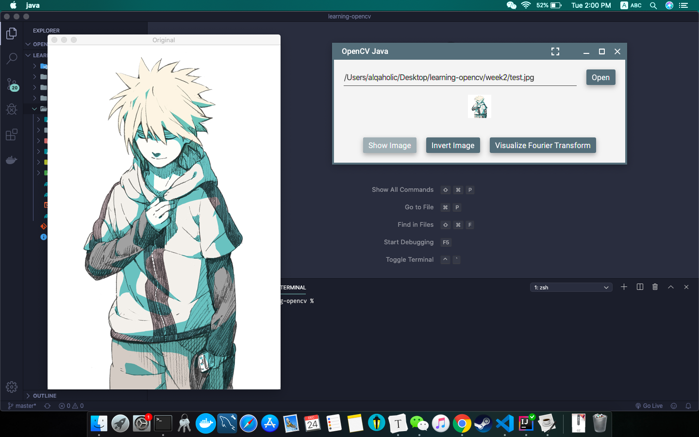

# learning-opencv

### week1

Entering the c++ world...

### week2

Setup OpenCV with CMake and perform basic mat operations

### week3

Intro to the Fourier Transform and its inverse...

### week4

Get started with OpenCV Java and JavaFX. Setup a gradle project and implement Fourier Transform with better GUI.

